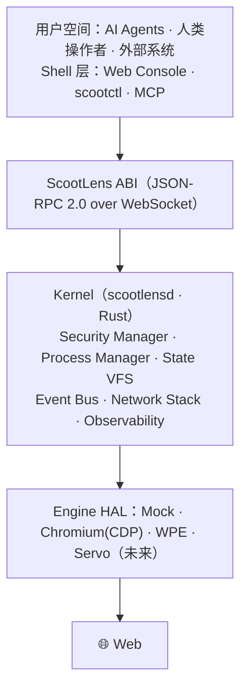

# ScootLens 🛴🔍

> **把 Web 会话当进程、站点状态当文件系统、权限做成 capability、浏览器引擎做成可替换驱动。**
> ScootLens 是一个 Web Operating System —— 为 AI Agent 与人类操作者提供统一、安全、可审计的 Web 系统调用接口。

它不是浏览器代理，不是自动化测试工具，也不是 Agent 框架。它是它们脚下的那层 **OS**。

## 为什么需要一个 "Web OS"？

| 工具视角（浏览器代理） | OS 视角（ScootLens） |
|---|---|
| Agent 是中心，浏览器是外设 | 内核是中心，Agent 只是用户空间的一个客户端 |
| 会话即用即弃 | 会话是进程：可挂起、恢复、快照/还原、长期驻留 |
| 安全靠 Agent 自觉 | 内核强制执行 capability，与 Agent 判断无关 |
| 单引擎绑定 | 多引擎 HAL：Chromium / WPE / Servo |
| 无审计 | 全链路 journal + trace + 录制回放 |

ScootLens 是一个**防御性的 capability 沙箱内核**：签名令牌、最小权限作用域、人工审批、
网络出口规则、凭据保险库、防篡改审计日志（hash-chain journal）——凭据永不进入 LLM 上下文。

## 架构一瞥



概念映射一句话版：进程 = Web 会话，系统调用 = 语义化 Web 操作，文件系统 = State VFS（cookie/storage/vault），
权限 = capability 令牌，驱动 = 浏览器引擎。详见 [docs/02-architecture.md](docs/02-architecture.md)。

## 快速开始

需要 Rust ≥ 1.85（见 `rust-toolchain.toml`）。想连真实浏览器请准备一个本地 Chromium/Chrome。

```bash
# 1. 构建
cargo build --workspace

# 2. 启动内核守护进程（首行会打印 admin token）
cargo run -p scootlensd -- --engine mock          # 无需浏览器，最快上手
# cargo run -p scootlensd -- --engine chromium    # 连接真实 Chromium

# 3. 换个终端，用 scootctl 发系统调用
export SCOOTLENS_TOKEN=<上一步打印的 admin token>
cargo run -p scootctl -- spawn                    # 创建 Web 进程，返回 pid
cargo run -p scootctl -- goto <pid> https://example.com
cargo run -p scootctl -- snapshot <pid>           # 语义快照（带元素 ref）
cargo run -p scootctl -- click <pid> <ref>        # 按 ref 点击元素
cargo run -p scootctl -- ps                       # 列出全部进程
```

常用守护进程参数：`--listen 127.0.0.1:9910`（默认）、`--state-dir <dir>`（持久化密钥/journal/vault，缺省为纯内存模式）、`--max-procs 8`、`--console-dir <dir>`（托管 Web Console 静态文件）、`--issue <subject>=<scope,…>`（额外签发受限令牌，可重复；敏感作用域默认人工审批）。

### Web Console

```bash
cd console
npm install
npm run dev        # 开发模式
npm run build      # 产物在 console/dist，可交给 scootlensd --console-dir 托管
npm run e2e        # Playwright UI e2e（需先 cargo build -p scootlensd 与 npm run build）
```

Console 完整版包含 Dashboard / **Session（screencast + 人工接管 + 输入注入）** /
**Inspector** / Approvals / Journal / **Replay（回放包离线验链播放）** / **Settings**。
浏览器打开 `http://127.0.0.1:9910/?token=<admin token>&connect=1` 即可直连。

### MCP 接入（Agent 生态）

`scootlens-mcp` 是 ABI 的 MCP 投影（stdio），工具清单由系统调用表自动生成
（`scootlens_<domain>_<verb>`）。在任意 MCP 客户端里配置：

```jsonc
{
  "mcpServers": {
    "scootlens": {
      "command": "scootlens-mcp",
      "env": {
        "SCOOTLENS_URL": "ws://127.0.0.1:9910/ws",
        "SCOOTLENS_TOKEN": "<scootlensd --issue 签发的受限令牌>"
      }
    }
  }
}
```

MCP 层零权限判断：作用域、限速、人工审批全部由内核强制（敏感调用会挂起等待
Console Approvals 里的人工批准）。

## 仓库导览

```
crates/
├── scootlens-abi       # ABI：核心类型、错误码、JSON-RPC 封装
├── scootlens-kernel    # 内核：进程/安全/状态/事件/调度
├── scootlens-hal       # 引擎硬件抽象层（trait）
├── scootlens-driver-mock      # Mock 驱动（测试专用，可编程页面模型）
├── scootlens-driver-chromium  # Chromium 驱动（外部进程 CDP）
├── scootlens-net       # 网络栈：出口规则强制、请求日志
├── scootlens-gateway   # WebSocket / HTTP 网关
├── scootlens-mcp       # MCP server（ABI 投影层）
├── scootlensd          # 内核守护进程（二进制）
├── scootctl            # 命令行客户端（二进制）
└── scootlens-test-support     # 测试支撑
console/                # Svelte Web Console（Dashboard / Session / Inspector / Approvals / Journal / Replay / Settings）
docs/                   # 设计文档（从 docs/README.md 开始读）
fixtures/               # e2e 测试站点
```

依赖规则是单向的：内核只认识 HAL trait，驱动在二进制层组装。谁也不许反向引用。

## 想深入了解？

按 [docs/README.md](docs/README.md) 的阅读顺序走即可：
[愿景](docs/01-vision.md) → [架构](docs/02-architecture.md) → [ABI 规范](docs/03-abi-spec.md) →
[内核设计](docs/04-kernel-design.md) → [引擎 HAL](docs/05-engine-hal.md) →
[安全模型](docs/06-security-model.md) → [Web Console](docs/07-web-console.md) →
[工程铁律](docs/08-engineering.md) → [路线图](docs/09-roadmap.md) → [ADR](docs/adr/README.md)

## 参与贡献

这个仓库有几条**不可协商的工程铁律**：

1. **TDD** —— 先写测试，红→绿→重构；bugfix 必须先有复现测试
2. **覆盖率 ≥ 80%** —— 每个 crate 行覆盖率 CI 强制
3. **严格模块边界** —— 单向依赖规则，CI 拦截违例
4. **分阶段交付** —— 按 [路线图](docs/09-roadmap.md) 阶段推进，禁止偷跑
5. **`unsafe_code = "forbid"`** —— 全 workspace 禁用 unsafe

提交前请本地过一遍：

```bash
cargo fmt --check && cargo clippy --workspace && cargo test --workspace
```

任何 ABI 变更需要先提交 [ADR](docs/adr/README.md) 并通过评审；文档与代码同仓同 PR。

## 许可证

[MIT](LICENSE)
