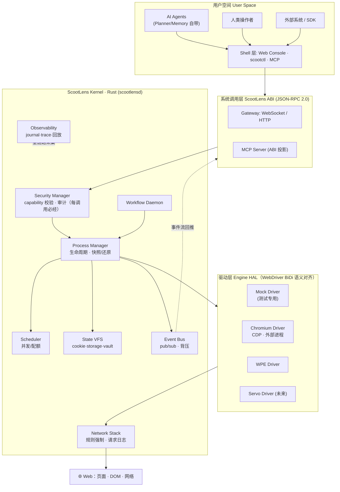
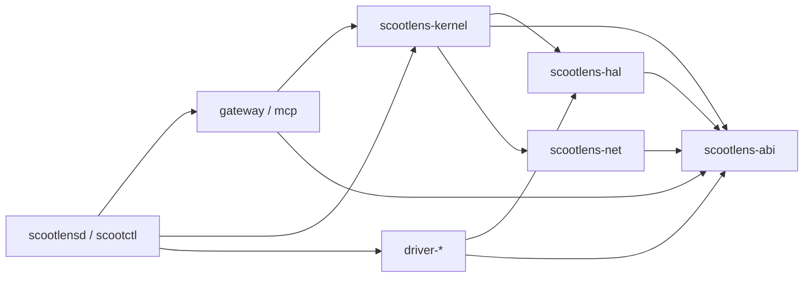
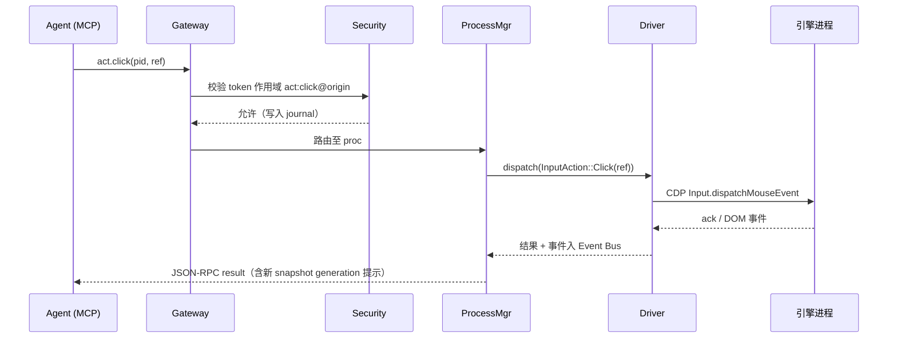

# 02 · 总体架构

## 概念映射

| 传统 OS | ScootLens |
|---|---|
| 进程 | Web Session（spawn/kill/挂起/恢复/快照/还原） |
| 系统调用 | 语义化 Web 操作 ABI（JSON-RPC 2.0 over WebSocket） |
| 文件系统 | State VFS（cookie/storage/下载/密钥库，按命名空间挂载） |
| 用户与权限 | Capability 令牌（主体 × 作用域 × 约束） |
| 驱动程序 | 引擎驱动（Chromium/CDP、WPE、Servo） |
| 防火墙 | 内核网络栈（规则强制、请求拦截） |
| cron/systemd | Workflow Daemon |
| /proc、syslog | Observability（journal/trace/回放） |

## 架构图



## 运行时拓扑

- `scootlensd`：单个 Rust 守护进程，托管内核全部子系统 + Gateway + 静态 Console
- 每个 proc 对应一个**独立引擎子进程**（独立 user-data-dir），引擎崩溃不影响内核
- 客户端（Agent/Console/CLI）一律通过 ABI 连接，无任何后门通道

## Workspace 模块划分（cargo workspace）

```text
scootlens/
├── crates/
│   ├── scootlens-abi          # ABI 类型 + 错误码 + serde（纯协议，零业务依赖）
│   ├── scootlens-hal          # EngineDriver/EngineHandle trait + 能力矩阵
│   ├── scootlens-kernel       # 进程/调度/VFS/事件/安全/观测
│   ├── scootlens-driver-mock  # 内存假引擎（TDD 基石）
│   ├── scootlens-driver-chromium  # CDP 驱动
│   ├── scootlens-driver-wpe   # WPE 驱动（Phase 5）
│   ├── scootlens-net          # 网络规则引擎与请求日志
│   ├── scootlens-gateway      # axum WS/HTTP + JSON-RPC 分发 + 静态 Console
│   ├── scootlens-mcp          # MCP server（rmcp），ABI 投影
│   ├── scootlensd             # 守护进程二进制（组装）
│   └── scootctl               # CLI 客户端
└── console/                   # Web Console（TypeScript + Vite + Svelte）
```

## 依赖规则（CI 强制，违反即失败）



1. `abi` 不依赖任何内部 crate（协议是地基）
2. `kernel` 只依赖 `hal` trait，**永不**依赖任何具体 driver
3. driver 之间互不依赖；driver 不依赖 kernel
4. 只有二进制 crate（`scootlensd`）允许同时依赖 kernel 与 driver 并完成注入组装
5. 循环依赖零容忍（`cargo-deny` + workspace 检查）

## 一次 act.click 的端到端时序


