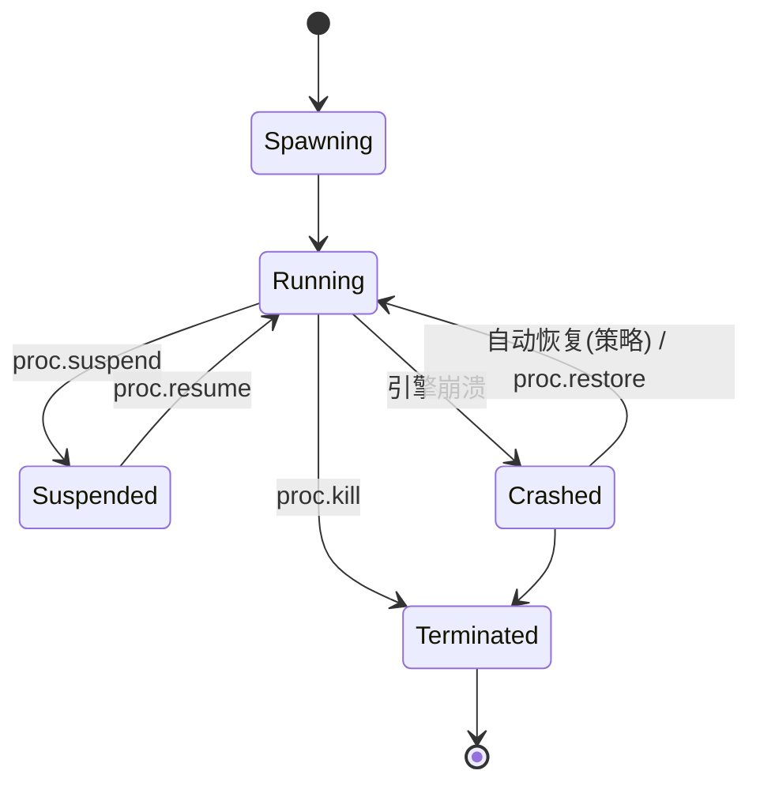

# 04 · 内核子系统设计

内核原则：**极简**。不需要特权的功能（规划、记忆、提示工程）永不进入内核。
内核只负责：进程、状态、安全、调度、驱动、观测。

## 4.1 Process Manager

进程 = 一个 Web 会话，绑定一个引擎子进程与独立 profile（user-data-dir）。

- **监督（supervision）**：驱动上报引擎存活；崩溃→标记 `Crashed`、广播 `proc.lifecycle` 事件、按策略从最近 proc.snapshot 自动恢复
- **proc.snapshot（P3）**：state.export（cookie/storage）+ 当前 URL/导航栈 + profile 归档 → 内容寻址存储；`restore` 可跨引擎（能力矩阵允许时）
- **隔离**：一 proc 一引擎进程一 profile 目录；目录权限 0700；proc 间无共享

## 4.2 Scheduler

- P1：全局并发上限 + spawn 排队（FIFO + 优先级）
- P3：配额 —— 每 proc 内存水位（驱动上报指标）、CPU nice（Linux cgroup v2 可用时）、网络限速（net 层）；超限→事件告警→按策略 suspend/kill
- 配额随 `proc.spawn` 声明，Security Manager 校验申请者是否有 `quota:high` 能力

## 4.3 State VFS

统一路径模型：`<ns>://<scope>/<path>`

| 命名空间 | 内容 | 读 | 写 |
|---|---|---|---|
| `proc://<pid>/cookies` | 会话 cookie | 🔒 | 🔒 |
| `proc://<pid>/storage` | local/sessionStorage、IndexedDB 元数据 | 🔒 | 🔒 |
| `profile://<name>/` | 持久 profile（可被多次 spawn 复用） | 🔒 | 🔒 |
| `downloads://<pid>/` | 下载文件（隔离沙箱目录） | ✔ | 内核写 |
| `vault://` | 密钥库 | **永不**（仅内核内部解引用） | Console/管理员 |

- 后端：SQLite（元数据/journal）+ 文件系统（profile/downloads）+ 平台 keyring 或 age 加密文件（vault）
- **vault 解引用**只发生在驱动注入输入的瞬间，值不落 journal、不落 trace、不回传

## 4.4 Event Bus

- tokio broadcast + 每订阅者有界队列
- **背压策略**：高频主题（`dom.mutation`、`net.*`）满时丢弃并累计 `dropped_count` 随下一条事件告知；生命周期/审批类主题**永不丢弃**（有界阻塞）
- 所有事件带单调 `seq` 与 `pid`，供回放对齐

## 4.5 Security Manager

见 [06-security-model.md](06-security-model.md)。内核侧要点：

- Gateway 分发前**单点强制**校验；journal 先行（先记后行）
- 🔒 作用域触发审批流：调用挂起 → `cap.request` 事件推送 Console → 批准/拒绝 → 恢复/返回 `E_CAP_DENIED`
- 深层强制：网络规则在 net 层独立执行，不信任上层已过滤

## 4.6 Network Stack

- P2：经驱动请求拦截（CDP `Fetch` domain）执行规则：allow/deny（域名/方法/资源类型）、header 注入、请求改写
- P4+：独立 Rust 代理（引擎无关的统一强制点 + HAR 采集），引擎以 proxy 模式接入
- 规则求值顺序：proc 级 → 全局级；默认策略可配置（默认 `allow` + 显式 denylist，或白名单模式）

## 4.7 Workflow Daemon（P3）

- 声明式 spec：触发器（cron / 事件）+ 步骤（ABI 调用序列 + 条件/重试）
- 以受限 capability 令牌运行（最小权限），失败重试带指数退避，全程 journal
- **不是** Agent 编排器：无 LLM 调用；需要智能的步骤交给用户空间 Agent 订阅事件后接管

## 4.8 Observability

| 机制 | 内容 | 存储 |
|---|---|---|
| journal | 每次 syscall：主体、作用域、参数摘要、结果、耗时（append-only） | SQLite WAL |
| trace | tracing span：gateway→security→kernel→driver 全链路 | OTLP 导出可选 |
| replay（P4） | syscall 序列 + screencast 帧 + 事件流，按 `seq` 对齐 | 回放包（zip） |

- 敏感值（vault、cookie 值）一律脱敏后入 journal
- `sys.info` 暴露配额水位与引擎健康，Console 仪表盘直接消费
