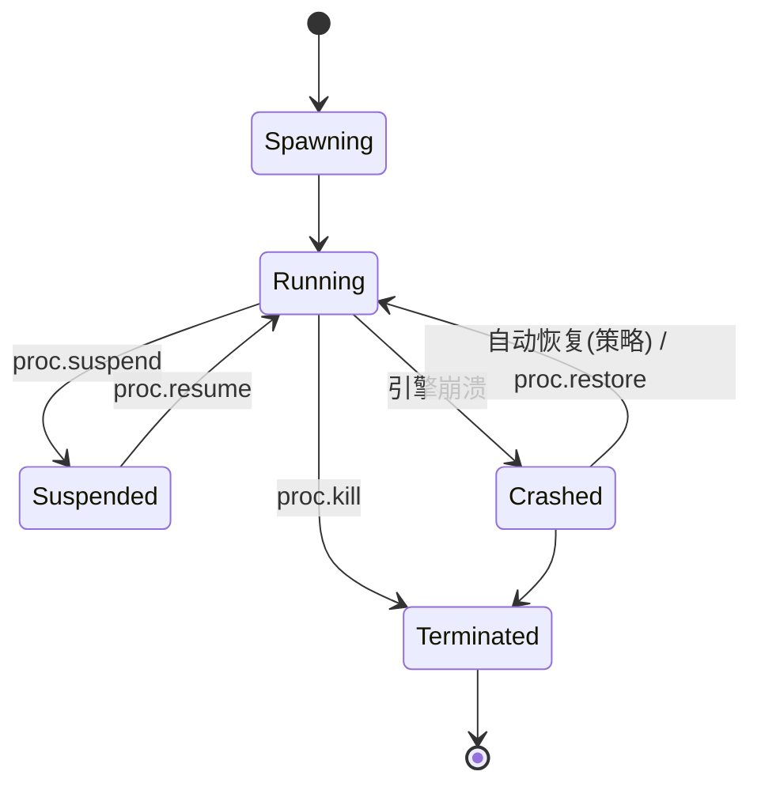

# 04 · 内核子系统设计

内核原则：**极简**。不需要特权的功能（规划、记忆、提示工程）永不进入内核。
内核只负责：进程、状态、安全、调度、驱动、观测。

## 4.1 Process Manager

进程 = 一个 Web 会话，绑定一个引擎子进程与独立 profile（user-data-dir）。

- **监督（supervision）**：驱动上报引擎存活；崩溃→标记 `Crashed`、广播 `proc.lifecycle` 事件、按策略从最近 proc.snapshot 自动恢复
- **proc.suspend/resume（P3 已落地）**：挂起把调度槽让还 Scheduler（挂起进程不占并发预算）、拒绝一切引擎操作（`E_INVALID_ARG`），引擎支持 `lifecycle` 能力时尽力冻结（Chromium `Page.setWebLifecycleState`；冻结失败不回滚挂起）；恢复按 FIFO 重新排队取槽后解冻
- **proc.snapshot/restore（P3 已落地）**：`export_state`（cookie/storage）+ 当前 URL + profile → 序列化为 `SnapshotDoc`，内容寻址存储（`state_dir/snapshots/<sha256 前 16hex>.json`，同状态幂等同 id）；`restore` = spawn（同 profile）→ 导航原 URL → 导入状态（先导航后导入，storage 依赖 origin 就位）；快照记录引擎 id，恢复时不匹配拒绝（跨引擎恢复留待能力矩阵允许时放开）
- **隔离**：一 proc 一引擎进程一 profile 目录；目录权限 0700；proc 间无共享
- **profile 复用（P3 已落地）**：`state.import` 把状态包合并写入 `state_dir/profiles/<name>.json`；以该 profile spawn 时（引擎具备 `state` 能力）自动预加载

## 4.2 Scheduler

- P1：全局并发上限 + spawn 排队（FIFO + 优先级）
- P3（已落地）：内存配额 —— `proc.spawn` 随 `quotas.max_memory_bytes` 声明；内核按 `quota_poll_interval` 轮询驱动 `metrics()`，越过水位（带去抖：回落后再越界才再次触发）→ journal `Deny` + `quota.exceeded` 事件 + 按 `on_exceed` 策略处置（warn / suspend / kill）；CPU nice 与网络限速为后续保留位
- 配额随 `proc.spawn` 声明，超过内核 `quota_high_bytes` 阈值时 Security Manager 额外校验 `quota:high` 能力

## 4.3 State VFS

统一路径模型：`<ns>://<scope>/<path>`

| 命名空间 | 内容 | 读 | 写 |
|---|---|---|---|
| `proc://<pid>/cookies` | 会话 cookie | 🔒 | 🔒 |
| `proc://<pid>/storage` | local/sessionStorage、IndexedDB 元数据 | 🔒 | 🔒 |
| `profile://<name>/` | 持久 profile（可被多次 spawn 复用） | 🔒 | 🔒 |
| `downloads://<pid>/` | 下载文件（隔离沙箱目录） | ✔ | 内核写 |
| `vault://` | 密钥库 | **永不**（仅内核内部解引用） | Console/管理员 |

- 后端：**P2 为文件系统**——vault（ChaCha20-Poly1305 加密文件 + `0600` 密钥）、downloads/uploads 沙箱目录、cookie/storage 经引擎 `export_state`/`import_state` 桥接；SQLite 元数据与平台 keyring 为后续演进
- P3 新增两个目录：`snapshots/`（proc.snapshot 的内容寻址文档，键为 sha256 前缀且白名单校验）与 `profiles/`（state.import 的合并状态，名字 `[A-Za-z0-9][A-Za-z0-9._-]*` 白名单防穿越）；无 state_dir 时退化为内存模式（测试/嵌入）
- uploads 沙箱：`act.upload` 的路径经 `canonicalize` + 前缀校验限制在 `<state-dir>/uploads/` 内，越界返回 `E_INVALID_ARG`（防目录穿越）
- **vault 解引用**只发生在驱动注入输入的瞬间，值不落 journal、不落 trace、不回传

## 4.4 Event Bus

- 自研总线（P3 起替换 tokio broadcast）：每订阅者独立 `VecDeque` + `Notify`，发布同步、消费异步
- **背压策略（已落地）**：高频主题（`nav`、`console`、`net.request`）队满时丢弃**同类**最旧事件并累计计数，`dropped` 随该订阅者的下一条事件带出；关键主题（`proc.lifecycle`、`cap.request`、`quota.exceeded`、`wf.run`）无界、永不丢弃，且不会被高频洪峰挤掉
- 所有事件带单调 `seq` 与 `pid`，供回放对齐

## 4.5 Security Manager

见 [06-security-model.md](06-security-model.md)。内核侧要点：

- Gateway 分发前**单点强制**校验；journal 先行（先记后行）
- 🔒 作用域触发审批流：调用挂起 → `cap.request` 事件推送 Console → 批准/拒绝 → 恢复/返回 `E_CAP_DENIED`
- 深层强制：网络规则在 net 层独立执行，不信任上层已过滤

## 4.6 Network Stack

- P2：经驱动请求拦截（CDP `Fetch` domain）执行规则：allow/deny（域名/方法/资源类型）、header 注入、请求改写
- P4+：独立 Rust 代理（引擎无关的统一强制点 + HAR 采集），引擎以 proxy 模式接入
- 规则求值顺序：proc 级 → 全局级；默认策略可配置（默认 `allow` + 显式 denylist，或白名单模式）

## 4.7 Workflow Daemon（P3 已落地）

- 声明式 spec：`name` + 触发器（cron 5 段 UTC / 总线事件 / manual）+ 步骤（ABI 调用序列 + 指数退避重试）+ `scopes`
- **最小权限闭包**：`wf.create` 校验 `spec.scopes ⊆ 创建者有效作用域`（拒绝提权）；运行主体为独立的 `wf:<name>`，只持有 spec 声明的作用域
- 每步经 Dispatcher 分发——journal 与鉴权免费获得，巡检流全程可追溯；单实例防重入（运行中触发被跳过，手动 `wf.run` 返回 `E_INVALID_ARG`）
- cron 精度到分钟（30s tick + 按分钟去重），时钟可注入（测试受控）
- **不是** Agent 编排器：无 LLM 调用；需要智能的步骤交给用户空间 Agent 订阅事件后接管

## 4.8 Observability

| 机制 | 内容 | 存储 |
|---|---|---|
| journal | 每次 syscall：主体、作用域、参数摘要、结果、耗时（append-only） | **P2 为 JSONL 哈希链**（`<state-dir>/journal.jsonl`，每行 `{seq,prev,hash,raw}`，`hash=sha256(prev+raw)`）；SQLite WAL 为 P3 |
| trace | tracing span：gateway→security→kernel→driver 全链路 | OTLP 导出可选 |
| replay（P4） | syscall 序列 + screencast 帧 + 事件流，按 `seq` 对齐 | 回放包（zip） |

- journal 三类记录点：`Call`（入口，参数已脱敏）、`Result`（成功，返回已消毒）、`Deny`（拒绝，含错误码）；哈希链可离线校验，任一行被修改则重放验链失败

- 敏感值（vault、cookie 值）一律脱敏后入 journal
- `sys.info` 暴露配额水位与引擎健康，Console 仪表盘直接消费
