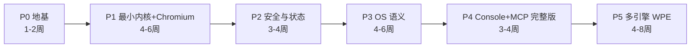

# 09 · 路线图与验收门禁

原则：**分阶段是铁律**。每阶段有明确范围（做什么/不做什么）与可度量的验收门禁；
门禁不过不进入下一阶段。时长为相对估计，供排期参考。

---

## Phase 0 · 地基（1-2 周）

**目标**：让所有铁律从第一行业务代码之前就生效。

**范围**
- cargo workspace 骨架（全部 crate 占位 + 依赖规则成立）
- `scootlens-abi` v0：核心类型、错误码、JSON-RPC 封装（TDD + 契约测试）
- `scootlens-hal` trait + `driver-mock` 最小可用（可编程页面模型）
- CI 全门禁上线（fmt/clippy/test/coverage/deny/gitleaks/unsafe 检查）
- `docs/` 即本套文档；ADR 流程生效

**明确不做**：任何真实引擎、任何网络代码

**验收门禁**
- [ ] CI 十项门禁全部启用且必须通过才能合并（用一个样例 PR 验证会被正确拦截）
- [ ] `cargo llvm-cov` ≥80% 在现有 crate 上强制生效
- [ ] abi 契约测试含 golden files；hal conformance 在 mock 上全绿
- [ ] 依赖规则违例（如 kernel 引用 driver）在 CI 被拦截的验证用例

---

## Phase 1 · 最小内核 + Chromium 驱动（4-6 周）— MVP

**目标**：一个 Agent 能通过 ABI 完成"spawn → goto → snapshot → act → 断言结果"的真实闭环。

**范围**
- kernel：Process Manager（Spawning/Running/Terminated/Crashed + 监督）、并发上限调度、Event Bus（基础主题）
- ABI 落地：`proc.spawn/list/info/kill`、`nav.*`、`view.snapshot/screenshot`、`act.click/type/press/scroll`、`evt.subscribe/wait`、`sys.info`
- Chromium 驱动：外部进程 CDP、代码生成的薄客户端、语义快照（剪枝 + ref + 代数）
- gateway：WS JSON-RPC + 令牌骨架（单一全权令牌，正式模型在 P2）
- `scootctl`：spawn/goto/snapshot/act/kill 命令行
- e2e：容器内 chromium + 本地 fixtures 站点

**明确不做**：审批流、State VFS、net 规则、Console UI

**验收门禁**
- [ ] e2e：登录表单 fixtures 场景（导航→填表→提交→断言跳转）全绿
- [ ] conformance suite 在 mock + chromium 双驱动通过（chromium 跳过率 <10%）
- [ ] 性能预算达标：spawn <1.5s、snapshot <300ms、act 往返 <50ms（CI 基准）
- [ ] 崩溃恢复测试：kill -9 引擎进程 → 内核标记 Crashed + 事件广播，内核自身零 panic
- [ ] 覆盖率 ≥80%；全门禁绿

---

## Phase 2 · 安全与状态（3-4 周）

**目标**：capability 全量强制 + State VFS + 网络规则；安全模型由策略强制（enforcement）测试集逐条验证拒绝路径。

**范围**
- Security Manager：令牌签发/校验/作用域匹配/限速/过期；🔒 审批流（挂起→审批→恢复）
- journal（append-only + 哈希链）+ 脱敏
- State VFS：cookies/storage 读写、vault（只写 + act.type 解引用）、downloads 沙箱
- net：CDP Fetch 拦截执行 allow/deny/header 规则、net.log
- ABI：`cap.*`、`state.*`、`net.*`、`js.exec`、`dom.extract`、`act.select/upload`、`obs.journal/trace`
- Console 最小版：Dashboard + Approvals + Journal（Svelte 骨架 + 门禁接入）

**验收门禁**
- [ ] 策略强制测试集通过：T1-T5 每类风险至少 2 个拒绝路径用例验证内核正确拦截（含 prompt-injection 诱导跨域用例）
- [ ] vault 凭据在 journal/trace/snapshot/ABI 返回中零出现（自动扫描断言）
- [ ] 无令牌/越权作用域的每个 syscall 都返回 `E_CAP_DENIED`（穷举契约测试）
- [ ] 审批流 e2e：js.exec 挂起 → Console 批准 → 恢复执行
- [ ] 覆盖率 ≥80%（含 console 包）；全门禁绿

---

## Phase 3 · OS 语义（4-6 周)

**目标**：ScootLens 区别于一切"浏览器工具"的核心能力上线。

**范围**
- proc.suspend/resume、proc.snapshot/restore（状态归档 + 内容寻址存储）
- Scheduler 配额：内存水位监控、超限策略（告警/suspend/kill）
- state.export/import、profile 复用
- Workflow Daemon：cron/事件触发 + 重试 + 最小权限令牌
- Event Bus 完整主题 + 背压策略落地

**验收门禁**
- [ ] 快照往返 e2e：登录态 proc → snapshot → kill → restore → 会话仍有效（fixtures 站点）
- [ ] 挂起 24h 模拟（时钟注入）后 resume 正常
- [ ] 配额测试：超内存 proc 被按策略处置且事件可观测
- [ ] workflow：cron 触发的巡检流全程 journal 可追溯
- [ ] 覆盖率 ≥80%；全门禁绿

---

## Phase 4 · Console 完整版 + MCP（3-4 周）

**目标**：人机协同闭环 + Agent 生态接入。

**范围**
- Console：Session 实时画面（screencast）+ 人工接管、Inspector、Replay 播放器、Settings/令牌管理
- `scootlens-mcp`：MCP server 投影（rmcp），能力声明与 ABI 同步生成
- obs.replay 导出；OTLP trace 导出可选项

**验收门禁**
- [ ] 真实 Agent（任一 MCP 客户端）通过 MCP 完成含人工审批的完整任务
- [ ] 接管 e2e：Agent 操作中 → 人接管输入 → 归还控制，事件序列正确
- [ ] 回放包可离线播放且与 journal 哈希链对得上
- [ ] Console UI e2e（Playwright）关键路径全绿；覆盖率 ≥80%

---

## Phase 5 · 多引擎：WPE（4-8 周）

**目标**：兑现低资源差异化承诺。

**范围**
- `driver-wpe`：FFI（unsafe 隔离 + SAFETY 政策）、conformance 适配
- 能力矩阵完善 + `E_UNSUPPORTED` 全链路
- 资源基准对比报告；ARM/嵌入式环境 CI job（可行时）

**验收门禁**
- [ ] WPE 通过 conformance 核心子集（跳过率 <25%，逐项登记原因）
- [ ] 单 proc 内存 < Chromium 基线 40%（基准报告入库）
- [ ] Phase 1 的 MVP e2e 场景在 WPE 上全绿
- [ ] FFI crate SAFETY 审计完成；覆盖率 ≥80%（FFI 绑定层按白名单豁免需评审）

---

## 之后（Backlog，不排期）

proc.fork / 跨机迁移、多节点集群、Servo 驱动、独立 MITM 代理统一网络强制、
RBAC 多用户、workflow 市场/包格式、WebRTC 画面通道。

## 风险登记

| 风险 | 影响 | 缓解 |
|---|---|---|
| CDP 版本漂移 | 驱动断裂 | 锁定 chromium 版本 + 协议代码生成 + conformance 回归 |
| WPE 自动化面不完整 | P5 延期 | 能力矩阵允许部分支持；提前 spike 验证（P3 期间安排 1 周预研） |
| 语义快照 token 成本失控 | Agent 可用性 | 剪枝参数化 + diff 模式 + golden 基准守护输出大小 |
| 范围蔓延（做成 Agent 框架） | 失焦 | 非目标清单 + 内核极简原则 + ADR 把关 |
